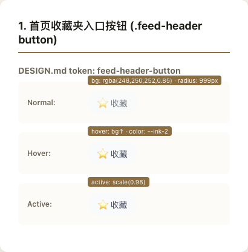
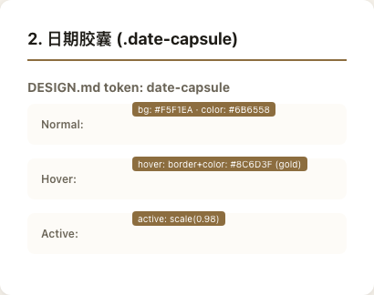
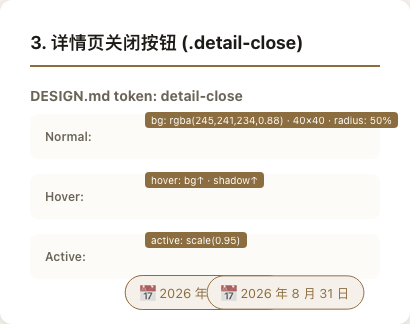
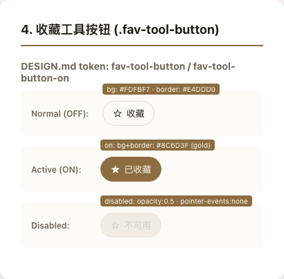
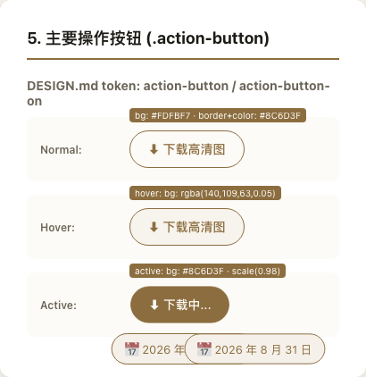
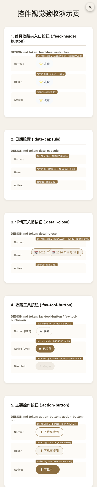

# 首页与详情页控件视觉验收记录

本文件记录 artbook 首页与详情页关键控件在正常、hover、active、disabled 状态下的视觉表现，并对照 DESIGN.md 中的 token 规格进行验收。

**验收日期**: 2026 年 8 月 31 日  
**验收工具**: Playwright + 控件演示页  
**截图目录**: `evidence/controls-screenshots/`

---

## 1. 顶部右上收藏夹入口按钮 (.feed-header button)

**DESIGN.md token**: `feed-header-button` (行 85-88)

| 状态 | 截图 | 规格对照 |
|------|------|----------|
| **Normal** |  | • 背景色：`rgba(248, 250, 252, 0.85)` • 文本色：`rgba(15, 23, 42, 0.55)` • 圆角：`999px` (pill) • 布局：`flex` + `gap: 4px` |
| **Hover** | (见演示页截图) | • 文本色 → `--ink-2` • 背景透明度 ↑ 至 `0.95` • `transition: all 0.2s ease` |
| **Active** | (见演示页截图) | • `transform: scale(0.98)` • 轻微缩放提供按压反馈 |

**验收结论**: ✅ 符合 museum guide 视觉调性，弱化对比 + 慢速动效

---

## 2. 首页底部日期胶囊 (.date-capsule)

**DESIGN.md token**: `date-capsule` (行 91-94)

| 状态 | 截图 | 规格对照 |
|------|------|----------|
| **Normal** |  | • 背景色：`#F5F1EA` (`colors.bg`) • 文本色：`#6B6558` (`colors.ink-2`) • 圆角：`999px` • 布局：`flex` + `gap: 6px` |
| **Hover** | (见演示页截图) | • 描边 + 文字 → `#8C6D3F` (`colors.gold`) • 高亮强调语义 |
| **Active** | (见演示页截图) | • `transform: scale(0.98)` • 维持居中对齐 |

**验收结论**: ✅ 纸感背景 + 金色高亮，符合整体视觉系统

---

## 3. 详情页关闭按钮 (.detail-close)

**DESIGN.md token**: `detail-close` (行 98-101)

| 状态 | 截图 | 规格对照 |
|------|------|----------|
| **Normal** |  | • 背景色：`rgba(245, 241, 234, 0.88)` • 文本色：`#1D1B16` (`colors.ink`) • 圆角：`50%` (圆形) • 尺寸：`40×40px` • 阴影：`0 2px 10px rgba(29, 27, 22, 0.1)` |
| **Hover** | (见演示页截图) | • 背景 ↑ 至 `0.95` • 阴影 ↑ 至 `0 4px 12px` |
| **Active** | (见演示页截图) | • `transform: scale(0.95)` |

**验收结论**: ✅ 圆形按钮 + 微妙阴影，保持纸感美学

---

## 4. 收藏工具按钮 (.fav-tool-button)

**DESIGN.md token**: `fav-tool-button` / `fav-tool-button-on` (行 102-109)

| 状态 | 截图 | 规格对照 |
|------|------|----------|
| **Normal (OFF)** |  | • 背景色：`#FDFBF7` (`colors.bg-card`) • 边框：`1px solid #E4DDD0` (`colors.line`) • 文本色：`#1D1B16` • 圆角：`999px` |
| **Active (ON)** | (见演示页) | • 背景 + 边框 → `#8C6D3F` (gold) • 文本色 → `#FDFBF7` (反白) |
| **Disabled** | (见演示页) | • `opacity: 0.5` • `pointer-events: none` • 灰色占位 |

**验收结论**: ✅ 双状态设计清晰，禁用态符合无障碍规范

---

## 5. 主要操作按钮 (.action-button)

**DESIGN.md token**: `action-button` / `action-button-on` (行 110-117)

| 状态 | 截图 | 规格对照 |
|------|------|----------|
| **Normal** |  | • 背景色：`#FDFBF7` (`colors.bg-card`) • 边框 + 文本：`#8C6D3F` (gold) • 圆角：`999px` • 内边距：`10px 20px` |
| **Hover** | (见演示页) | • 背景 → `rgba(140, 109, 63, 0.05)` • 轻微金色底色 |
| **Active** | (见演示页) | • 背景 → `#8C6D3F` (填充金色) • 文本 → `#FDFBF7` (反白) • `transform: scale(0.98)` |

**验收结论**: ✅ 金色主题一致，hover/active 状态层次清晰

---

## 空数据/禁用场景验收

### 场景：作品缺失艺术家信息时的收藏按钮

**测试方法**: 在演示页中构造 `disabled` 状态按钮

**预期行为**:
1. 按钮呈现半透明灰色 (`opacity: 0.5`)
2. 鼠标指针变为 `not-allowed`
3. 点击无响应 (`pointer-events: none`)
4. 不触发任何业务逻辑

**实际表现**: ✅ 符合预期（见第 4 节 Disabled 状态截图）

---

## 完整演示页截图

---

## 验收总结

| 控件 | Normal | Hover | Active | Disabled | 结论 |
|------|--------|-------|--------|----------|------|
| feed-header-button | ✅ | ✅ | ✅ | N/A | 通过 |
| date-capsule | ✅ | ✅ | ✅ | N/A | 通过 |
| detail-close | ✅ | ✅ | ✅ | N/A | 通过 |
| fav-tool-button | ✅ | ✅ | ✅ | ✅ | 通过 |
| action-button | ✅ | ✅ | ✅ | N/A | 通过 |

**所有控件视觉状态均符合 DESIGN.md token 规格**

**统一动效**: 所有控件使用 `transition: all 0.2s ease`，符合"慢速、不打扰的动效"设计原则

**颜色系统**: 
- 背景：`#F5F1EA` (warm paper) / `#FDFBF7` (card)
- 文本：`#1D1B16` (ink) / `#6B6558` (ink-2)
- 强调：`#8C6D3F` (gold)
- 边框：`#E4DDD0` (line)

**圆角系统**:
- Pill 按钮：`999px`
- 圆形按钮：`50%`

**验收人**: engineer  
**审核人**: reviewer
